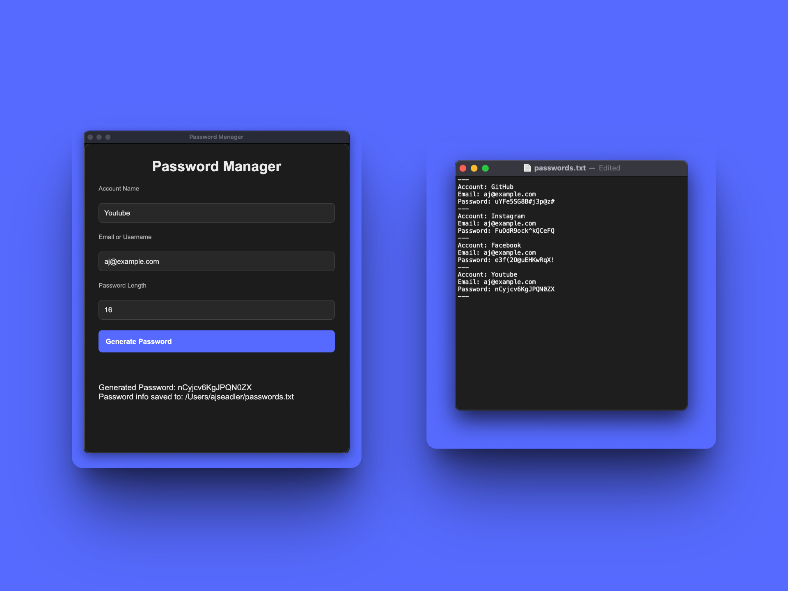

# 🔐 C# Password Generator



- Generate passwords with letters, numbers, and symbols
- Adjustable password length
- Lightweight and fast
- Clean and modern console output

### Requirements

- .NET SDK 6.0 or later
- A C# development environment (e.g., Visual Studio, Rider, or VS Code)

### Running the Project

1. Clone the repository:
   ```bash
   git clone https://github.com/ajSeadler/C--UI.git
   cd password-generator
   ```
